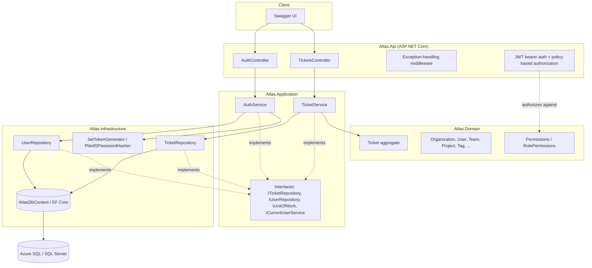
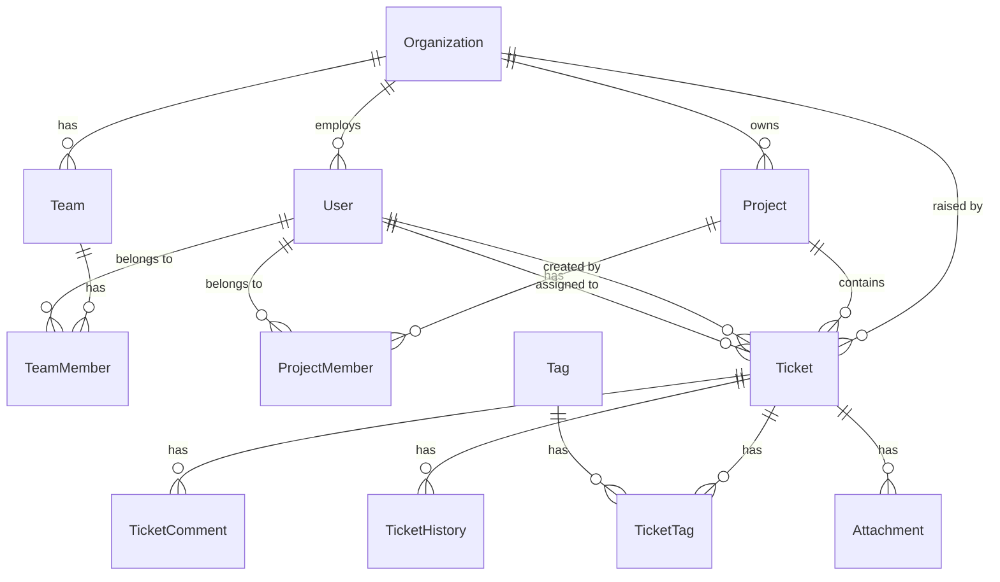

# Project Atlas

Enterprise ticket & operations management platform for a fictional company,
**Northstar IT**, and its customers (e.g. **ACME AB**). Built as a learning
project that mirrors the shape of a real .NET/Azure enterprise system —
Clean Architecture, EF Core against Azure SQL, and a build-out path through
authentication, messaging, caching, observability, containers and CI/CD.

This repository currently covers **Phase 1 — Foundation** (solution
structure, the full SQL data model, EF Core, the first real API) and the
first slice of **Phase 2 — Real application**: local JWT authentication and
permission-based authorization. Later phases are tracked in
[Roadmap](#roadmap) below.

## Architecture



Dependencies point inward, Clean-Architecture style:

```
Atlas.Api  -->  Atlas.Application  -->  Atlas.Domain
Atlas.Infrastructure  -->  Atlas.Application  -->  Atlas.Domain
```

`Atlas.Domain` has zero package references. `Atlas.Application` defines the
interfaces (`ITicketRepository`, `IUnitOfWork`, `ICurrentUserService`) that
`Atlas.Infrastructure` implements against EF Core — the Dependency Inversion
Principle, not just a folder convention.

## Technology

- C# 13 / **.NET 10**
- ASP.NET Core Web API
- **Entity Framework Core 10** (Code-First, migrations)
- **Azure SQL Database** / SQL Server (T-SQL) — see [`sql/`](sql/) for the
  hand-written reference schema
- **JWT bearer authentication** (HS256, `System.IdentityModel.Tokens.Jwt`) with
  **permission-based authorization policies** — see
  [Authentication & authorization](#authentication--authorization) below
- PBKDF2-HMAC-SHA256 password hashing (BCL `System.Security.Cryptography`,
  no external package)
- xUnit for domain unit tests
- Swagger / OpenAPI (ASP.NET Core's built-in generator + Swashbuckle UI)

Planned for later phases (see [Roadmap](#roadmap)): Azure Entra ID, Azure
Blob Storage, Azure Service Bus, a background worker, Redis, Application
Insights, Docker, GitHub Actions, Bicep, Key Vault, and a React frontend.

## Project structure

```
ProjectAtlas.sln
src/
  Atlas.Domain/            Entities, enums, domain exceptions, Permissions/RolePermissions
  Atlas.Application/       DTOs, service interfaces, TicketService, AuthService
  Atlas.Infrastructure/    EF Core DbContext, entity configurations, repositories,
                           JwtTokenGenerator, Pbkdf2PasswordHasher
  Atlas.Api/                Controllers (Tickets, Auth), Program.cs, appsettings
tests/
  Atlas.Domain.Tests/       xUnit tests for Ticket's business rules, RolePermissions, User
sql/
  001_InitialSchema.sql     Hand-written T-SQL reference (see note below)
  002_SeedData.sql          Optional demo data (Northstar IT / ACME AB / one ticket)
docs/
  ARCHITECTURE.md
```

## Data model

14 tables, matching the domain: `Organizations`, `Users`, `Teams`,
`TeamMembers`, `Projects`, `ProjectMembers`, `Tickets`, `TicketComments`,
`TicketHistory`, `Tags`, `TicketTags`, `Attachments`, `Notifications`,
`AuditLogs`.



`sql/001_InitialSchema.sql` is a hand-written T-SQL reference kept in sync
with the EF Core model in `Atlas.Infrastructure/Persistence/Configurations`.
**EF Core migrations are the actual source of truth** — see
[Getting started](#getting-started) below for the exact commands. The SQL
file exists so the schema can be read and reviewed without opening C#, and
as a fallback reference.

## Getting started

### Prerequisites

- .NET 10 SDK
- SQL Server LocalDB, a local SQL Server instance, SQL Server in Docker, or
  an Azure SQL database
- The EF Core CLI tool: `dotnet tool install --global dotnet-ef` (skip if
  already installed — you clearly have a full SQL/Azure toolchain here)

### 1. Restore and build

```bash
dotnet restore
dotnet build
```

### 2. Point the API at a database

`src/Atlas.Api/appsettings.Development.json` ships with a LocalDB connection
string:

```
Server=(localdb)\mssqllocaldb;Database=AtlasDb;Trusted_Connection=True;MultipleActiveResultSets=true;TrustServerCertificate=True
```

No LocalDB? Point `ConnectionStrings:AtlasDb` at a Docker SQL Server
instance or an Azure SQL database instead — anything reachable over T-SQL
works. For a real secret (Azure SQL password, AAD connection string), use
`dotnet user-secrets` rather than committing it:

```bash
cd src/Atlas.Api
dotnet user-secrets set "ConnectionStrings:AtlasDb" "<your connection string>"
```

### 3. Create and apply the first migration

The model exists in code (`Atlas.Infrastructure/Persistence/Configurations`)
but no migration has been generated yet — that's the very first thing to
run in this repo:

```bash
cd src/Atlas.Api
dotnet ef migrations add InitialCreate --project ../Atlas.Infrastructure --startup-project .
dotnet ef database update             --project ../Atlas.Infrastructure --startup-project .
```

(`Atlas.Api` also auto-applies pending migrations on startup in the
Development environment, so `dotnet run` alone is enough after the first
`migrations add`.)

Optionally load demo data:

```bash
sqlcmd -S "(localdb)\mssqllocaldb" -d AtlasDb -i ..\..\sql\002_SeedData.sql
```

### 4. Run the API

```bash
dotnet run --project src/Atlas.Api
```

Swagger UI opens automatically at `https://localhost:5081/swagger` (or
`http://localhost:5080/swagger`).

### 5. Try it

Every `/api/tickets` endpoint requires a bearer token (see
[Authentication & authorization](#authentication--authorization) below).
Register a user, log in, then use the token:

```bash
# Register (Admin role gets every permission — handy for trying the API out)
curl -X POST "https://localhost:5081/api/auth/register" -k \
     -H "Content-Type: application/json" \
     -d '{"fullName":"Ada Admin","email":"ada@northstar-it.example","password":"correct-horse-battery","organizationId":"<org-guid>","role":3}'

# Log in — copy the "token" field from the response
curl -X POST "https://localhost:5081/api/auth/login" -k \
     -H "Content-Type: application/json" \
     -d '{"email":"ada@northstar-it.example","password":"correct-horse-battery"}'

TOKEN="<paste the token here>"

# List tickets
curl "https://localhost:5081/api/tickets?status=InProgress&priority=High&page=1&pageSize=25" -k \
     -H "Authorization: Bearer $TOKEN"

# Create a ticket — the acting user now comes from the token, not a query parameter
curl -X POST "https://localhost:5081/api/tickets" -k \
     -H "Authorization: Bearer $TOKEN" -H "Content-Type: application/json" \
     -d '{"title":"Customer cannot login","description":"500 on login page","organizationId":"<org-guid>","priority":2}'

# Assign it
curl -X POST "https://localhost:5081/api/tickets/<ticket-guid>/assign" -k \
     -H "Authorization: Bearer $TOKEN" -H "Content-Type: application/json" \
     -d '{"userId":"<agent-guid>"}'
```

### 6. Run the tests

```bash
dotnet test
```

## Authentication & authorization

`POST /api/auth/register` and `POST /api/auth/login` are the only anonymous
endpoints in the API. Every other endpoint requires an
`Authorization: Bearer <token>` header.

- **Tokens** are HS256-signed JWTs issued by `JwtTokenGenerator`
  (`Atlas.Infrastructure/Security`), valid for `Jwt:ExpiryMinutes` (60 by
  default). The signing key lives in `appsettings.Development.json` for
  local dev only — see the comment on `JwtSettings` for why that's fine here
  but not in Azure (Del 18 moves it to Key Vault).
- **Passwords** are hashed with PBKDF2-HMAC-SHA256, 100,000 iterations, via
  `Pbkdf2PasswordHasher` — no external hashing package, just the BCL's
  `System.Security.Cryptography`.
- **Authorization is permission-based, not role-based.** Each `UserRole`
  (`Customer`, `Agent`, `Manager`, `Admin`) maps to a set of fine-grained
  `Permissions` (`Ticket.Read`, `Ticket.Assign`, `Project.Manage`, ...) via
  `RolePermissions` (`Atlas.Domain/Security`). Every permission the user's
  role grants is baked into the JWT as its own `"permission"` claim at login
  time, and `Program.cs` registers one ASP.NET Core authorization policy per
  permission so controllers can write
  `[Authorize(Policy = Permissions.TicketAssign)]` instead of checking roles
  directly — tightening what a role can do is a one-line change in
  `RolePermissions`, never a controller edit.
- `ICurrentUserService` (`Atlas.Api/Services/CurrentUserService.cs`) reads
  the acting user's id straight from the token's `sub` claim, so controller
  actions no longer take an `actorUserId`/`createdByUserId` query parameter
  — that was a pre-auth stopgap from Phase 1 and is gone now.

## Business rules worth reading

`Atlas.Domain/Entities/Ticket.cs` is the heart of the model — it owns every
state transition so the rules can't be bypassed by a controller or a
careless service method:

- A brand-new ticket starts in `New`; assigning it moves it to `Open`.
- A `Closed` or `Cancelled` ticket must be explicitly `Reopen()`-ed before
  it can be modified again.
- Escalating a ticket to `Critical` priority requires a reason.
- Every field change on a ticket appends an entry to `TicketHistory` —
  there is no code path that mutates status/priority/assignment without
  also recording who changed it and when.

`tests/Atlas.Domain.Tests/TicketTests.cs` exercises all of this without a
database.

## Roadmap

- [x] **Phase 1 — Foundation**: solution, SQL data model, EF Core, first API (this repo)
- [~] **Phase 2 — Real application**: local JWT auth & permission policies done (Del 5);
      users/projects endpoints and richer ticket workflows still to come
- [ ] **Phase 3 — Azure**: Azure SQL, App Service, Blob Storage, Key Vault
- [ ] **Phase 4 — Enterprise**: Service Bus, background worker, Redis, audit logging
- [ ] **Phase 5 — Quality**: broader test suite, Docker, structured logging, monitoring
- [ ] **Phase 6 — DevOps**: GitHub Actions CI/CD, Bicep (Infrastructure as Code)
- [ ] **Phase 7 — Polish**: React frontend, dashboard, demo environment

See the conversation history / project notes for the detailed breakdown of
each phase (Del 1–20) — each one lands as its own set of commits/PRs so the
git history itself becomes part of the portfolio.
