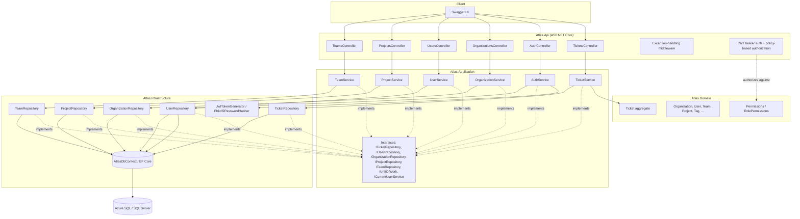
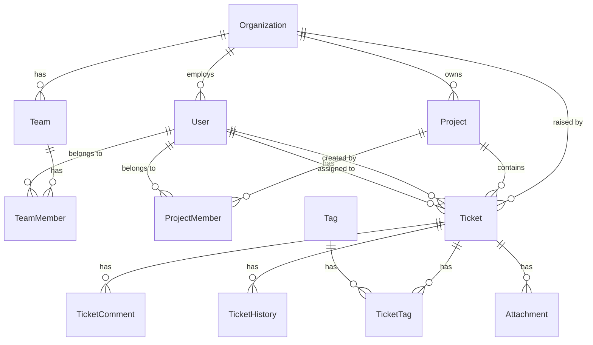

# Project Atlas

Enterprise ticket & operations management platform for a fictional company,
**Northstar IT**, and its customers (e.g. **ACME AB**). Built as a learning
project that mirrors the shape of a real .NET/Azure enterprise system —
Clean Architecture, EF Core against Azure SQL, and a build-out path through
authentication, messaging, caching, observability, containers and CI/CD.

This repository currently covers **Phase 1 — Foundation** (solution
structure, the full SQL data model, EF Core, the first real API) and three
slices of **Phase 2 — Real application**: local JWT authentication with
permission-based authorization (Del 5), Organizations & Users management
(Del 6), and Projects & Teams management (Del 7). Later phases are tracked in
[Roadmap](#roadmap) below.

## Architecture



Dependencies point inward, Clean-Architecture style:

```
Atlas.Api  -->  Atlas.Application  -->  Atlas.Domain
Atlas.Infrastructure  -->  Atlas.Application  -->  Atlas.Domain
```

`Atlas.Domain` has zero package references. `Atlas.Application` defines the
interfaces (`ITicketRepository`, `IUnitOfWork`, `ICurrentUserService`) that
`Atlas.Infrastructure` implements against EF Core — the Dependency Inversion
Principle, not just a folder convention.

## Technology

- C# 13 / **.NET 10**
- ASP.NET Core Web API
- **Entity Framework Core 10** (Code-First, migrations)
- **Azure SQL Database** / SQL Server (T-SQL) — see [`sql/`](sql/) for the
  hand-written reference schema
- **JWT bearer authentication** (HS256, `System.IdentityModel.Tokens.Jwt`) with
  **permission-based authorization policies** — see
  [Authentication & authorization](#authentication--authorization) below
- PBKDF2-HMAC-SHA256 password hashing (BCL `System.Security.Cryptography`,
  no external package)
- xUnit for domain unit tests
- Swagger / OpenAPI (ASP.NET Core's built-in generator + Swashbuckle UI)
- **.NET Generic Host / Worker Service** (`Atlas.Worker`) — a second, separate
  host process for background work, distinct from `Atlas.Api`'s ASP.NET Core
  host; see [Del 11](#roadmap) below

Planned for later phases (see [Roadmap](#roadmap)): Azure Service Bus, Redis,
Application Insights, Docker, Bicep, and a React frontend. (Key Vault and a
CI/CD pipeline are already in place as of Del 8, Azure SQL and Blob Storage
as of Del 9/10, and a background worker as of Del 11 — see below — all
pulled forward rather than left for later.)

## Project structure

```
ProjectAtlas.sln
src/
  Atlas.Domain/            Entities, enums, domain exceptions, Permissions/RolePermissions
  Atlas.Application/       DTOs, service interfaces — TicketService, AuthService,
                           OrganizationService, UserService, ProjectService, TeamService
  Atlas.Infrastructure/    EF Core DbContext, entity configurations, repositories
                           (Ticket, User, Organization, Project, Team), JwtTokenGenerator,
                           Pbkdf2PasswordHasher
  Atlas.Api/                Controllers (Tickets, Auth, Organizations, Users, Projects, Teams),
                           Program.cs, appsettings
tests/
  Atlas.Domain.Tests/       xUnit tests for Ticket's business rules, RolePermissions, User,
                           Organization, Project, Team
sql/
  001_InitialSchema.sql     Hand-written T-SQL reference (see note below)
  002_SeedData.sql          Optional demo data (Northstar IT / ACME AB / one ticket)
docs/
  ARCHITECTURE.md
```

## Data model

14 tables, matching the domain: `Organizations`, `Users`, `Teams`,
`TeamMembers`, `Projects`, `ProjectMembers`, `Tickets`, `TicketComments`,
`TicketHistory`, `Tags`, `TicketTags`, `Attachments`, `Notifications`,
`AuditLogs`.



`sql/001_InitialSchema.sql` is a hand-written T-SQL reference kept in sync
with the EF Core model in `Atlas.Infrastructure/Persistence/Configurations`.
**EF Core migrations are the actual source of truth** — see
[Getting started](#getting-started) below for the exact commands. The SQL
file exists so the schema can be read and reviewed without opening C#, and
as a fallback reference.

## Getting started

### Prerequisites

- .NET 10 SDK
- SQL Server LocalDB, a local SQL Server instance, SQL Server in Docker, or
  an Azure SQL database
- The EF Core CLI tool: `dotnet tool install --global dotnet-ef` (skip if
  already installed — you clearly have a full SQL/Azure toolchain here)
- Node.js/npm, only if you want to test file attachments locally (Del 10) —
  needed for Azurite, see step 4 below. Everything else in this repo builds
  and runs without it.

### 1. Restore and build

```bash
dotnet restore
dotnet build
```

### 2. Point the API at a database

`src/Atlas.Api/appsettings.Development.json` ships with a LocalDB connection
string:

```
Server=(localdb)\mssqllocaldb;Database=AtlasDb;Trusted_Connection=True;MultipleActiveResultSets=true;TrustServerCertificate=True
```

No LocalDB? Point `ConnectionStrings:AtlasDb` at a Docker SQL Server
instance or an Azure SQL database instead — anything reachable over T-SQL
works. For a real secret (Azure SQL password, AAD connection string), use
`dotnet user-secrets` rather than committing it:

```bash
cd src/Atlas.Api
dotnet user-secrets set "ConnectionStrings:AtlasDb" "<your connection string>"
```

### 3. Create and apply the first migration

The model exists in code (`Atlas.Infrastructure/Persistence/Configurations`)
but no migration has been generated yet — that's the very first thing to
run in this repo:

```bash
cd src/Atlas.Api
dotnet ef migrations add InitialCreate --project ../Atlas.Infrastructure --startup-project .
dotnet ef database update             --project ../Atlas.Infrastructure --startup-project .
```

(`Atlas.Api` also auto-applies pending migrations on startup in the
Development environment, so `dotnet run` alone is enough after the first
`migrations add`.)

Optionally load demo data:

```bash
sqlcmd -S "(localdb)\mssqllocaldb" -d AtlasDb -i ..\..\sql\002_SeedData.sql
```

### 4. Install and start Azurite (only needed to test file attachments — Del 10)

Ticket attachments (`POST /api/tickets/{id}/attachments`) are stored in Azure
Blob Storage. Locally, that means [Azurite](https://learn.microsoft.com/azure/storage/common/storage-use-azurite) —
a free, Microsoft-official emulator that speaks the real Blob Storage wire
protocol, the same role LocalDB plays for Azure SQL. It's an npm package, not
Docker, so no container runtime is needed:

```bash
npm install -g azurite
azurite --silent --location ./.azurite --debug ./.azurite/debug.log
```

Leave that running in its own terminal — `appsettings.Development.json`
already points `BlobStorage:ConnectionString` at Azurite's well-known local
endpoint (`UseDevelopmentStorage=true`), so there's nothing else to
configure. **Start Azurite before `dotnet run`**: the API creates its blob
container during startup (see `AddInfrastructure` in
`Atlas.Infrastructure/DependencyInjection.cs`), so if Azurite isn't listening
yet, `dotnet run` fails immediately with a connection error rather than
starting in a half-working state. If you don't care about attachments right
now, you can skip this step entirely — every other endpoint works fine
without Azurite running; only the two attachment endpoints will fail.

### 5. Run the API

```bash
dotnet run --project src/Atlas.Api
```

Swagger UI opens automatically at `https://localhost:5081/swagger` (or
`http://localhost:5080/swagger`).

### 6. Try it

Every endpoint except `POST /api/auth/register` and `POST /api/auth/login`
requires a bearer token (see
[Authentication & authorization](#authentication--authorization) below).

**Bootstrapping note — a real chicken-and-egg problem, not a bug:**
`POST /api/auth/register` requires a real `organizationId` (it's a foreign
key — see the `FK_Users_Organizations_OrganizationId` story this project ran
into while testing Del 5), but creating an organization through the API
(`POST /api/organizations`) requires `Organization.Manage`, which only an
Admin has, and the only way to become an Admin is... to register. On a truly
empty database there is no way around running `sql/002_SeedData.sql` (or
inserting one row into `Organizations` by hand) once, just to get the very
first real `organizationId` to register your first Admin against. After
that, every organization from the second one onward can go through the API
— no more raw SQL needed.

```bash
# Register (Admin role gets every permission — handy for trying the API out).
# <org-guid> here must be a real Organizations.Id — see the bootstrapping note above.
curl -X POST "https://localhost:5081/api/auth/register" -k \
     -H "Content-Type: application/json" \
     -d '{"fullName":"Ada Admin","email":"ada@northstar-it.example","password":"correct-horse-battery","organizationId":"<org-guid>","role":3}'

# Log in — copy the "token" field from the response
curl -X POST "https://localhost:5081/api/auth/login" -k \
     -H "Content-Type: application/json" \
     -d '{"email":"ada@northstar-it.example","password":"correct-horse-battery"}'

TOKEN="<paste the token here>"

# List tickets
curl "https://localhost:5081/api/tickets?status=InProgress&priority=High&page=1&pageSize=25" -k \
     -H "Authorization: Bearer $TOKEN"

# Create a ticket — the acting user now comes from the token, not a query parameter
curl -X POST "https://localhost:5081/api/tickets" -k \
     -H "Authorization: Bearer $TOKEN" -H "Content-Type: application/json" \
     -d '{"title":"Customer cannot login","description":"500 on login page","organizationId":"<org-guid>","priority":2}'

# Assign it
curl -X POST "https://localhost:5081/api/tickets/<ticket-guid>/assign" -k \
     -H "Authorization: Bearer $TOKEN" -H "Content-Type: application/json" \
     -d '{"userId":"<agent-guid>"}'

# Tag it (get-or-create by name — no separate "create the tag" step), then remove the tag
curl -X POST "https://localhost:5081/api/tickets/<ticket-guid>/tags" -k \
     -H "Authorization: Bearer $TOKEN" -H "Content-Type: application/json" \
     -d '{"name":"login"}'

curl -X POST "https://localhost:5081/api/tickets/<ticket-guid>/tags/remove" -k \
     -H "Authorization: Bearer $TOKEN" -H "Content-Type: application/json" \
     -d '{"name":"login"}'

# Close it, then reopen it
curl -X POST "https://localhost:5081/api/tickets/<ticket-guid>/status" -k \
     -H "Authorization: Bearer $TOKEN" -H "Content-Type: application/json" \
     -d '{"status":"Closed"}'

curl -X POST "https://localhost:5081/api/tickets/<ticket-guid>/reopen" -k \
     -H "Authorization: Bearer $TOKEN"

# List tickets for one project only
curl "https://localhost:5081/api/tickets?projectId=<project-guid>&page=1&pageSize=25" -k \
     -H "Authorization: Bearer $TOKEN"

# Permanently delete a ticket (Manager/Admin only — Permissions.TicketDelete).
# This is a real hard delete: it cascade-deletes the ticket's comments, history,
# tags and attachments too. For "we're done with this but want to keep the audit
# trail", use POST .../status with {"status":"Cancelled"} instead.
curl -X DELETE "https://localhost:5081/api/tickets/<ticket-guid>" -k \
     -H "Authorization: Bearer $TOKEN"

# Create a second organization — from here on, no more raw SQL is needed (Del 6)
curl -X POST "https://localhost:5081/api/organizations" -k \
     -H "Authorization: Bearer $TOKEN" -H "Content-Type: application/json" \
     -d '{"name":"Contoso Ltd","type":1}'

# List organizations
curl "https://localhost:5081/api/organizations?isActive=true&page=1&pageSize=25" -k \
     -H "Authorization: Bearer $TOKEN"

# List users, e.g. everyone in one organization
curl "https://localhost:5081/api/users?organizationId=<org-guid>&page=1&pageSize=25" -k \
     -H "Authorization: Bearer $TOKEN"

# Promote a user to Agent (role 1 = Agent — see UserRole)
curl -X POST "https://localhost:5081/api/users/<user-guid>/role" -k \
     -H "Authorization: Bearer $TOKEN" -H "Content-Type: application/json" \
     -d '{"role":1}'

# Create a project (Del 7) — the "externally-facing work" kind, e.g. a customer engagement
curl -X POST "https://localhost:5081/api/projects" -k \
     -H "Authorization: Bearer $TOKEN" -H "Content-Type: application/json" \
     -d '{"organizationId":"<org-guid>","name":"ACME Onboarding Q3","description":"Kickoff through go-live"}'

# Add and then remove a member from the project
curl -X POST "https://localhost:5081/api/projects/<project-guid>/members" -k \
     -H "Authorization: Bearer $TOKEN" -H "Content-Type: application/json" \
     -d '{"userId":"<agent-guid>"}'

curl -X DELETE "https://localhost:5081/api/projects/<project-guid>/members/<agent-guid>" -k \
     -H "Authorization: Bearer $TOKEN"

# Archive a project, then bring it back
curl -X POST "https://localhost:5081/api/projects/<project-guid>/archive" -k \
     -H "Authorization: Bearer $TOKEN"

curl -X POST "https://localhost:5081/api/projects/<project-guid>/unarchive" -k \
     -H "Authorization: Bearer $TOKEN"

# Create a team (Del 7) — the "internal organization" kind, e.g. a support tier
curl -X POST "https://localhost:5081/api/teams" -k \
     -H "Authorization: Bearer $TOKEN" -H "Content-Type: application/json" \
     -d '{"organizationId":"<org-guid>","name":"Support Tier 1"}'

# Add and then remove a team member
curl -X POST "https://localhost:5081/api/teams/<team-guid>/members" -k \
     -H "Authorization: Bearer $TOKEN" -H "Content-Type: application/json" \
     -d '{"userId":"<agent-guid>"}'

curl -X DELETE "https://localhost:5081/api/teams/<team-guid>/members/<agent-guid>" -k \
     -H "Authorization: Bearer $TOKEN"

# Upload an attachment (Del 10 — needs Azurite running, see step 4). Note
# -F instead of -d/-H Content-Type: this is a multipart/form-data upload,
# not JSON: the form field name must be "file".
curl -X POST "https://localhost:5081/api/tickets/<ticket-guid>/attachments" -k \
     -H "Authorization: Bearer $TOKEN" \
     -F "file=@screenshot.png"

# Download it back (attachment-guid comes from the upload response's "id",
# or from GET /api/tickets/<ticket-guid>'s "attachments" list)
curl "https://localhost:5081/api/tickets/<ticket-guid>/attachments/<attachment-guid>/download" -k \
     -H "Authorization: Bearer $TOKEN" \
     -o downloaded-screenshot.png
```

### 7. Run the tests

```bash
dotnet test
```

## Deploying to Azure (Del 8–9)

`docs/AZURE_DEPLOYMENT.md` is a step-by-step, copy-pasteable checklist:
resource group, App Service plan and Web App, application settings, a
passwordless (workload identity federation) Azure Pipelines pipeline that
builds/tests/deploys on every push to `main` (`azure-pipelines.yml`, run
from Azure DevOps), Azure SQL wired in via Key Vault (section 7), and how
to verify it. As of Del 9 (confirmed working end-to-end 2026-09-10), the
whole API is functional in Azure — not just `/health` and Swagger — since
App Service can finally reach a real cloud database instead of the local
SQL Server this project used through Del 1–7.

## Authentication & authorization

`POST /api/auth/register` and `POST /api/auth/login` are the only anonymous
endpoints in the API. Every other endpoint requires an
`Authorization: Bearer <token>` header.

- **Tokens** are HS256-signed JWTs issued by `JwtTokenGenerator`
  (`Atlas.Infrastructure/Security`), valid for `Jwt:ExpiryMinutes` (60 by
  default). The signing key lives in `appsettings.Development.json` for
  local dev only; in Azure it's an Azure Key Vault secret instead (pulled
  forward into Del 8 — see `docs/AZURE_DEPLOYMENT.md` §3 and
  `docs/ARCHITECTURE.md`).
- **Passwords** are hashed with PBKDF2-HMAC-SHA256, 100,000 iterations, via
  `Pbkdf2PasswordHasher` — no external hashing package, just the BCL's
  `System.Security.Cryptography`.
- **Authorization is permission-based, not role-based.** Each `UserRole`
  (`Customer`, `Agent`, `Manager`, `Admin`) maps to a set of fine-grained
  `Permissions` (`Ticket.Read`, `Ticket.Assign`, `Project.Manage`, ...) via
  `RolePermissions` (`Atlas.Domain/Security`). Every permission the user's
  role grants is baked into the JWT as its own `"permission"` claim at login
  time, and `Program.cs` registers one ASP.NET Core authorization policy per
  permission so controllers can write
  `[Authorize(Policy = Permissions.TicketAssign)]` instead of checking roles
  directly — tightening what a role can do is a one-line change in
  `RolePermissions`, never a controller edit.
- `ICurrentUserService` (`Atlas.Api/Services/CurrentUserService.cs`) reads
  the acting user's id straight from the token's `sub` claim, so controller
  actions no longer take an `actorUserId`/`createdByUserId` query parameter
  — that was a pre-auth stopgap from Phase 1 and is gone now.
- **Organization.Manage is deliberately Admin-only** (Del 6) — creating,
  renaming or deactivating an organization is a different kind of operation
  from managing the people or projects *inside* one, since it touches the
  tenant boundary itself. `User.Manage`, by contrast, is granted to both
  Manager and Admin, on the theory that a Manager runs their own team
  day-to-day. See the doc comment on `RolePermissions` for the full
  reasoning, and `UsersController.ChangeRole`/`Deactivate` for a small but
  important guard: nobody — not even an Admin — can change their own role or
  deactivate their own account through these endpoints, so a mistake there
  can't lock the caller out with no one else able to fix it.
- Because Del 5's JWTs are plain and non-revocable, a role change made via
  `POST /api/users/{id}/role` only takes effect the next time that user logs
  in — the token they're currently holding still carries their old
  `"permission"` claims until it expires or they sign in again.
- **Project.Manage and Team.Manage (Del 7) sit at the same Manager+Admin trust
  level as User.Manage**, not the Admin-only Organization.Manage — creating a
  project or an internal team is routine work *inside* an organization a
  Manager already belongs to, not a tenant-boundary change. `Project.Read`/
  `Project.Manage` existed in `Permissions` since early on but had no
  controller wired up to them until this Del; `Team.Read`/`Team.Manage` are
  new permissions introduced by it.

## Business rules worth reading

`Atlas.Domain/Entities/Ticket.cs` is the heart of the model — it owns every
state transition so the rules can't be bypassed by a controller or a
careless service method:

- A brand-new ticket starts in `New`; assigning it moves it to `Open`.
- A `Closed` or `Cancelled` ticket must be explicitly `Reopen()`-ed before
  it can be modified again.
- Escalating a ticket to `Critical` priority requires a reason.
- Every field change on a ticket appends an entry to `TicketHistory` —
  there is no code path that mutates status/priority/assignment without
  also recording who changed it and when.

`tests/Atlas.Domain.Tests/TicketTests.cs` exercises all of this without a
database.

## Roadmap

- [x] **Phase 1 — Foundation**: solution, SQL data model, EF Core, first API (this repo)
- [x] **Phase 2 — Real application**: local JWT auth & permission policies (Del 5),
      Organizations & Users management (Del 6), Projects & Teams management
      and the richer ticket workflows (reopen, tag by name, filter by project,
      real hard-delete) that closed out Del 7
- [~] **Phase 3 — Azure**: Del 8, Del 9 and Del 10 all confirmed working
      end-to-end against the live subscription (2026-09-10/11) — App Service +
      Azure Pipelines CI/CD pipeline (Azure DevOps), JWT signing key, the
      Azure SQL connection string, *and* the Blob Storage account URL all
      resolved via the same managed-identity/Key Vault or plain-App-Setting
      pattern (see `docs/AZURE_DEPLOYMENT.md`); `POST /api/auth/register`/
      `/login` returning a real JWT through App Service against a live Azure
      SQL database, and `POST /api/tickets/{id}/attachments` uploading to
      and downloading from a real Azure Storage account. Del 20 is now
      mostly just "generalize the Key Vault setup, add a least-privilege
      SQL login"
- [~] **Phase 4 — Enterprise**: Del 11 (background worker for overdue-ticket
      notifications) confirmed working end-to-end (2026-09-11) — a second
      host process, `Atlas.Worker` (.NET Generic Host, not ASP.NET Core),
      polling every 5 minutes and writing to the `Notifications` table
      through the same `AtlasDb`; Service Bus, Redis and audit logging remain
- [ ] **Phase 5 — Quality**: broader test suite, Docker, structured logging, monitoring
- [ ] **Phase 6 — DevOps**: Bicep (Infrastructure as Code) — CI/CD itself
      already exists as of Del 8, on Azure Pipelines
- [ ] **Phase 7 — Polish**: React frontend, dashboard, demo environment

See the conversation history / project notes for the detailed breakdown of
each phase (Del 1–22) — each one lands as its own set of commits/PRs so the
git history itself becomes part of the portfolio.
