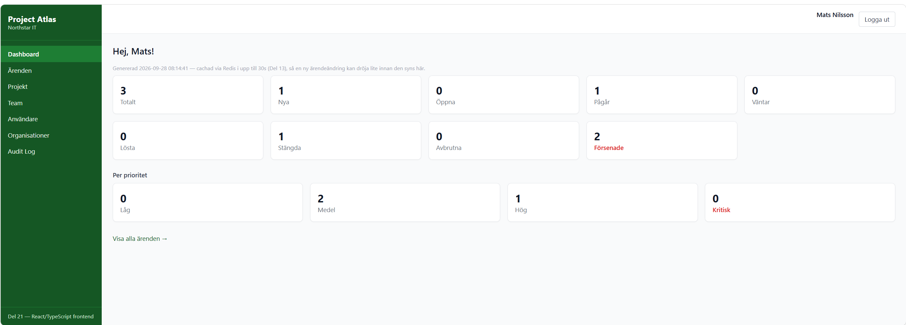
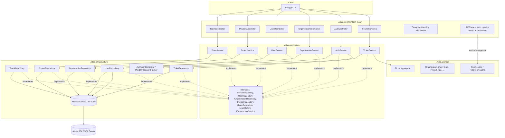
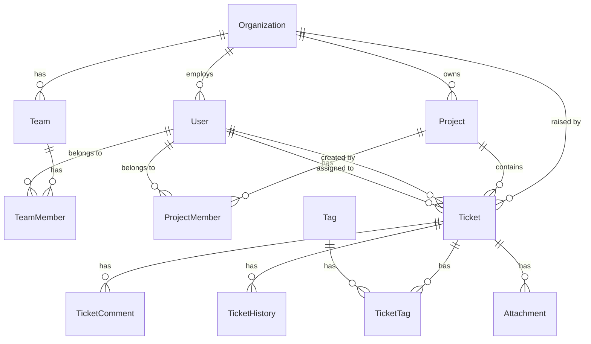

# Project Atlas

Enterprise ticket & operations management platform for a fictional company,
**Northstar IT**, and its customers (e.g. **ACME AB**). Built as a learning
project that mirrors the shape of a real .NET/Azure enterprise system —
Clean Architecture, EF Core against Azure SQL, and a build-out path through
authentication, messaging, caching, observability, containers and CI/CD.

This repository has worked through six of its seven planned phases end to
end: solution structure, the full SQL data model and the first real API
(**Phase 1**); local JWT authentication with permission-based
authorization, and Organizations/Users/Projects/Teams management (**Phase
2**); Azure App Service, Azure SQL and Blob Storage, all deployed against a
live subscription (**Phase 3**); a background worker, Service Bus
messaging, Redis caching and a system-wide audit trail (**Phase 4**);
structured logging, a 93-unit/19-integration-test suite and Docker
(**Phase 5**); and CI/CD plus the entire Azure environment redeployable
from Bicep (**Phase 6**). **Phase 7 — Polish** is nearly there too: a full
React frontend (Del 21) is built and verified, both locally and against
Docker; the one open piece is an actual Azure deployment for a live demo
(Del 22). See [Roadmap](#roadmap) below for the Del-by-Del breakdown,
including the two remaining cleanup items carried over from earlier phases
(Del 20's Key Vault generalization, and deciding how `Atlas.Worker` gets
hosted in Azure).



## Architecture



Dependencies point inward, Clean-Architecture style:

```
Atlas.Api  -->  Atlas.Application  -->  Atlas.Domain
Atlas.Infrastructure  -->  Atlas.Application  -->  Atlas.Domain
```

`Atlas.Domain` has zero package references. `Atlas.Application` defines the
interfaces (`ITicketRepository`, `IUnitOfWork`, `ICurrentUserService`) that
`Atlas.Infrastructure` implements against EF Core — the Dependency Inversion
Principle, not just a folder convention.

## Technology

- C# 13 / **.NET 10**
- ASP.NET Core Web API
- **Entity Framework Core 10** (Code-First, migrations)
- **Azure SQL Database** / SQL Server (T-SQL) — see [`sql/`](sql/) for the
  hand-written reference schema
- **JWT bearer authentication** (HS256, `System.IdentityModel.Tokens.Jwt`) with
  **permission-based authorization policies** — see
  [Authentication & authorization](#authentication--authorization) below
- PBKDF2-HMAC-SHA256 password hashing (BCL `System.Security.Cryptography`,
  no external package)
- **xUnit**, across three test projects with three different scopes (Del 16):
  domain unit tests (`Atlas.Domain.Tests`), Application-layer unit tests with
  **Moq** mocking every repository/service interface
  (`Atlas.Application.Tests`), and real end-to-end HTTP tests via
  **`Microsoft.AspNetCore.Mvc.Testing`**'s `WebApplicationFactory<Program>`
  against a dedicated LocalDB database (`Atlas.Api.IntegrationTests`) — see
  [Del 16](#roadmap) below and "[Run the tests](#9-run-the-tests)"
- Swagger / OpenAPI (ASP.NET Core's built-in generator + Swashbuckle UI)
- **.NET Generic Host / Worker Service** (`Atlas.Worker`) — a second, separate
  host process for background work, distinct from `Atlas.Api`'s ASP.NET Core
  host; see [Del 11](#roadmap) below
- **Azure Service Bus** (`Azure.Messaging.ServiceBus`, Topics/Subscriptions) —
  publish/subscribe messaging between `Atlas.Api` and `Atlas.Worker`; see
  [Del 12](#roadmap) below
- **Redis** (`Microsoft.Extensions.Caching.StackExchangeRedis`) — cache-aside
  for `GET /api/tickets/stats`, with explicit invalidation on the ticket
  writes that actually change it; see [Del 13](#roadmap) below
- **System-wide audit trail** (`GET /api/audit-logs`) — no new technology:
  `AuditLogs` reuses the same Azure SQL database every other table already
  lives in; see [Del 15](#roadmap) below
- **Structured logging** (`Serilog.AspNetCore`, console sink locally) with an
  optional **Application Insights** sink (`Serilog.Sinks.ApplicationInsights`,
  wired up only when `ApplicationInsights:ConnectionString` is set) — see
  [Del 14](#roadmap) below
- **Docker** (`src/Atlas.Api/Dockerfile`, multi-stage: SDK to build, the much
  smaller ASP.NET Core runtime image to ship) and **Docker Compose**
  (`docker-compose.yml`) running the whole local stack — `Atlas.Api` plus
  containerized SQL Server, Redis and Azurite — in one command; see
  [Del 17](#roadmap) below and "[Alternative: run everything in
  Docker](#alternative-run-everything-in-docker-del-17)" above
- **Bicep** (`infra/`) — Infrastructure as Code for the Azure environment
  every earlier phase built by hand, one `az` command at a time: the
  resource group's App Service plan/Web App, the Azure SQL database, the
  Blob Storage account, and the Service Bus role assignment are all
  redeployable from `infra/main.bicep`, and Application Insights and Redis
  (Azure Managed Redis, not the classic, now-retiring Azure Cache for
  Redis — see [Del 19](#roadmap) below) went from "documented plan" to
  actually provisioned in Azure for the first time via this Del; see
  [Del 19](#roadmap) below
- **Frontend** (`frontend/` — React 18.3, TypeScript 5.6, Vite 5.4, Tailwind
  CSS 3.4, TanStack Query 5.59, `react-router-dom` 6.26) — a full CRUD
  client covering all five entities plus Auth and a read-only Audit Log,
  built directly against the real API contract (numeric enums, the exact
  `Permissions.cs` strings, the real JWT claims); see [Del 21](#roadmap)
  below

Remaining open point: an actual Azure deployment of the frontend, for a
live demo that doesn't need Peter's own workstation — drafted as a
checklist in `docs/DEMO_DEPLOY_CHECKLIST.md` (Del 22 candidate) but not yet
run against a real subscription. Everything else originally planned for
"later" has been pulled forward instead of left for later: Key Vault and a CI/CD
pipeline are already in place as of Del 8, Azure SQL and Blob Storage as of
Del 9/10, a background worker as of Del 11, Service Bus publish/consume as
of Del 12, Redis caching as of Del 13, structured logging with an optional
Application Insights sink as of Del 14, the audit trail as of Del 15, a
broader test suite (93 unit + 19 integration tests) as of Del 16, the whole
local stack running in Docker as of Del 17, that Docker image verified on
every CI run as of Del 18, the entire Azure environment redeployable from
Bicep — including, as of Del 19, actually-provisioned Application Insights
and Redis instances — and, as of Del 21, the React frontend itself, covering
every entity end to end.

## Project structure

```
ProjectAtlas.sln
docker-compose.yml         Del 17 — sqlserver/redis/azurite/api, healthchecks,
                           condition: service_healthy gating api's startup
.dockerignore               Del 17 — keeps host bin/obj/tests/docs out of the build context
infra/                      Del 19 — Infrastructure as Code (Bicep)
  main.bicep                 Orchestrator, resource-group scoped; see its own header
                             comment for exactly what it does/doesn't manage and how
                             to run it (az bicep build / what-if / create)
  main.parameters.json       Parameter values — fill in your own Key Vault/SQL server/
                             Service Bus namespace names and resource groups before use
  modules/                   One file per resource type — App Service plan, Web App,
                             SQL database, Storage account, Application Insights, Redis
                             (Azure Managed Redis), plus the Service Bus role assignment;
                             Key Vault/Storage role-assignment modules also live here,
                             kept for reference though not called from main.bicep (see
                             its header comment — that grant already exists from Del 8/10)
src/
  Atlas.Domain/            Entities, enums, domain exceptions, Permissions/RolePermissions
  Atlas.Application/       DTOs, service interfaces — TicketService, AuthService,
                           OrganizationService, UserService, ProjectService, TeamService;
                           ITicketEventPublisher (Del 12), ITicketStatsCache (Del 13);
                           Audit/ — IAuditLogService, AuditLogService (Del 15)
  Atlas.Infrastructure/    EF Core DbContext, entity configurations, repositories
                           (Ticket, User, Organization, Project, Team), JwtTokenGenerator,
                           Pbkdf2PasswordHasher, Messaging/ServiceBusTicketEventPublisher
                           (Del 12), Caching/RedisTicketStatsCache (Del 13),
                           Repositories/AuditLogRepository (Del 15)
  Atlas.Api/               Controllers (Tickets, Auth, Organizations, Users, Projects, Teams,
                           AuditLogs), Program.cs (Del 14: two-stage Serilog
                           bootstrap + UseSerilogRequestLogging; also exposes
                           `public partial class Program {}` for Del 16's
                           WebApplicationFactory<Program>), Dockerfile (Del 17 —
                           multi-stage build, see the file's own top comment),
                           appsettings, appsettings.Testing.json (Del 16 — a
                           dedicated AtlasDb_Test connection string),
                           appsettings.Docker.json (Del 17 — sqlserver/redis/azurite
                           reached by Compose service name, not localhost)
  Atlas.Worker/            .NET Generic Host (Del 11) — OverdueTicketWorker (polls every
                           5 minutes) and TicketAssignedConsumer (Del 12, Service Bus).
                           No Dockerfile of its own yet (Del 17 is scoped to Atlas.Api)
tests/
  Atlas.Domain.Tests/       xUnit tests for Ticket's business rules, RolePermissions, User,
                           Organization, Project, Team, AuditLog
  Atlas.Application.Tests/ Del 16 — xUnit + Moq unit tests for every Application-layer
                           service (Auth, User, Organization, Project, Team, Ticket),
                           each repository/cache/publisher mocked; no database or
                           other external system needed
  Atlas.Api.IntegrationTests/ Del 16 — xUnit + WebApplicationFactory<Program> tests that
                           make real HTTP calls through real JWT auth and real
                           [Authorize(Policy=...)] enforcement against a dedicated
                           AtlasDb_Test LocalDB database (ApiFactory); tagged
                           [Trait("Category","Integration")] and excluded from
                           CI (see azure-pipelines.yml) since it needs LocalDB,
                           Azurite, Redis and `az login` locally
sql/
  001_InitialSchema.sql     Hand-written T-SQL reference (see note below)
  002_SeedData.sql          Optional demo data (Northstar IT / ACME AB / one ticket)
scripts/
  test-del13-redis-cache.sh Cache-hit/invalidation/fail-open smoke test for Del 13 (see
                           the "Try it" section above)
  test-del14-logging.sh    End-to-end smoke test for Del 14 — Serilog's console format,
                           UseSerilogRequestLogging, and the new WRN-level failed-login
                           log lines, run by starting Atlas.Api's built DLL directly
  test-del15-audit-log.sh  End-to-end smoke test for Del 15 — 7 checks across
                           User/Organization/Project/Ticket audit events plus the
                           Admin-only access check (see the "Try it" section above)
frontend/                   Del 21 — React 18.3/TypeScript 5.6/Vite 5.4/Tailwind 3.4/
                           TanStack Query 5.59/react-router-dom 6.26
  src/api/                  types.ts (hand-mirrored DTOs/enums — numeric, not string,
                           see the Technology section above), client.ts (fetch wrapper,
                           ApiError), one module per controller
  src/auth/                 permissions.ts (mirrors Permissions.cs literally), session.ts,
                           jwt.ts (decodes organization_id client-side — see Del 21 in
                           docs/ARCHITECTURE.md), AuthContext.tsx, ProtectedRoute.tsx
  src/components/           Layout.tsx (permission-gated nav), Status.tsx, Feedback.tsx,
                           Pagination.tsx, ui.ts (shared Tailwind class constants)
  src/pages/                LoginPage, DashboardPage, and List/Create/Detail pages per
                           entity (tickets/, organizations/, users/, projects/, teams/,
                           auditlogs/)
  App.tsx                   Full route tree, every route wrapped in ProtectedRoute/
                           RequirePermission
docs/
  ARCHITECTURE.md
  AZURE_DEPLOYMENT.md
  DEMO_DEPLOY_CHECKLIST.md   Draft, not yet run end-to-end — see the file's own header
```

## Data model

14 tables, matching the domain: `Organizations`, `Users`, `Teams`,
`TeamMembers`, `Projects`, `ProjectMembers`, `Tickets`, `TicketComments`,
`TicketHistory`, `Tags`, `TicketTags`, `Attachments`, `Notifications`,
`AuditLogs`.



`sql/001_InitialSchema.sql` is a hand-written T-SQL reference kept in sync
with the EF Core model in `Atlas.Infrastructure/Persistence/Configurations`.
**EF Core migrations are the actual source of truth** — see
[Getting started](#getting-started) below for the exact commands. The SQL
file exists so the schema can be read and reviewed without opening C#, and
as a fallback reference.

## Getting started

### Prerequisites

- .NET 10 SDK
- SQL Server LocalDB, a local SQL Server instance, SQL Server in Docker, or
  an Azure SQL database
- The EF Core CLI tool: `dotnet tool install --global dotnet-ef` (skip if
  already installed — you clearly have a full SQL/Azure toolchain here)
- Node.js/npm, only if you want to test file attachments locally (Del 10) —
  needed for Azurite, see step 4 below. Everything else in this repo builds
  and runs without it.

### 1. Restore and build

```bash
dotnet restore
dotnet build
```

### Alternative: run everything in Docker (Del 17)

Steps 2–7 below (LocalDB, Redis, Azurite, `dotnet run`) each set up one piece
of the local stack by hand. `docker-compose.yml` (repository root) sets up
all four containers — a real SQL Server, a real Redis, a real Azurite, and
`Atlas.Api` itself — in one command, each reachable from the others by
Compose service name (see `src/Atlas.Api/appsettings.Docker.json`, a third
environment alongside Development and Testing):

```bash
docker compose up --build
```

The first run is slow (pulling SQL Server's own multi-hundred-MB image, then
a full `dotnet restore` inside the build stage); every run after that reuses
Docker's build cache. Once it settles, Swagger UI is at
`http://localhost:8080/swagger` — a different port than steps 7/8 below,
since those run `Atlas.Api` directly on the host instead of inside a
container. `docker compose up` waits for `sqlserver`/`redis`/`azurite`'s own
healthchecks before starting `api`, and `Atlas.Api` auto-applies EF Core
migrations on startup for this environment too (the same convenience
Development already has), so the containerized `AtlasDb` is created and
migrated automatically — no manual `dotnet ef database update` needed here.

You'll likely see one or two transient `Login failed for user 'sa'` errors
in the `sqlserver`/`api` logs during the first startup — SQL Server's own
password-policy initialization racing the healthcheck probe and `api`'s
first connection attempt. Both are expected and self-healing: the stack
retries and continues on its own (`EnableRetryOnFailure` plus the compose
healthcheck gate), and migrations complete right after. Not a sign anything
is broken.

This containerized `AtlasDb` starts just as empty as a fresh LocalDB would,
so the same bootstrapping note in step 8 below applies here too — you need
one real `organizationId` before `POST /api/auth/register` will work. Load
`sql/002_SeedData.sql` into the running container instead of against
LocalDB:

```bash
docker compose cp sql/002_SeedData.sql sqlserver:/tmp/002_SeedData.sql
docker compose exec sqlserver /opt/mssql-tools18/bin/sqlcmd -S localhost -U sa -P "P@ssw0rd_Atlas2026" -C -d AtlasDb -i /tmp/002_SeedData.sql
docker compose exec sqlserver /opt/mssql-tools18/bin/sqlcmd -S localhost -U sa -P "P@ssw0rd_Atlas2026" -C -d AtlasDb -Q "SELECT Id, Name FROM dbo.Organizations"
```

(If your image doesn't have `mssql-tools18`, use `/opt/mssql-tools/bin/sqlcmd`
without `-C` instead — the healthcheck in `docker-compose.yml` tries both for
the same reason.) **Running this in Git Bash on Windows?** Prefix each
`docker compose exec` line with `MSYS_NO_PATHCONV=1` — Git Bash otherwise
rewrites the Unix-style `/opt/...` path into a Windows path before Docker
ever sees it, which fails with a confusing "no such file or directory" from
inside the container.

`docker compose down` stops everything; add `-v` to also delete the SQL
Server data volume and start from a genuinely empty database next time.
Deliberately not included: `Atlas.Worker` and a Service Bus emulator — see
`docker-compose.yml`'s own top comment and `docs/ARCHITECTURE.md`'s Del 17
section for why.

### 2. Point the API at a database

`src/Atlas.Api/appsettings.Development.json` ships with a LocalDB connection
string:

```
Server=(localdb)\mssqllocaldb;Database=AtlasDb;Trusted_Connection=True;MultipleActiveResultSets=true;TrustServerCertificate=True
```

No LocalDB? Point `ConnectionStrings:AtlasDb` at a Docker SQL Server
instance or an Azure SQL database instead — anything reachable over T-SQL
works. For a real secret (Azure SQL password, AAD connection string), use
`dotnet user-secrets` rather than committing it:

```bash
cd src/Atlas.Api
dotnet user-secrets set "ConnectionStrings:AtlasDb" "<your connection string>"
```

### 3. Create and apply the first migration

The model exists in code (`Atlas.Infrastructure/Persistence/Configurations`)
but no migration has been generated yet — that's the very first thing to
run in this repo:

```bash
cd src/Atlas.Api
dotnet ef migrations add InitialCreate --project ../Atlas.Infrastructure --startup-project .
dotnet ef database update             --project ../Atlas.Infrastructure --startup-project .
```

(`Atlas.Api` also auto-applies pending migrations on startup in the
Development environment, so `dotnet run` alone is enough after the first
`migrations add`.)

Optionally load demo data:

```bash
sqlcmd -S "(localdb)\mssqllocaldb" -d AtlasDb -i ..\..\sql\002_SeedData.sql
```

### 4. Configure Azure Service Bus (only needed to test real-time notifications — Del 12)

Unlike SQL (LocalDB) and Blob Storage (Azurite, below), Service Bus has no
first-party local emulator, so Del 12 deliberately uses the same real Azure
namespace for local development that Azure itself would use — see the doc
comment on `AddMessaging` in `Atlas.Infrastructure/DependencyInjection.cs`
for the full reasoning. To test `POST /api/tickets/{id}/assign` publishing a
`TicketAssigned` event and `Atlas.Worker` picking it up:

1. You need a Service Bus namespace on the **Standard** tier or above (the
   free Basic tier doesn't support Topics). Set
   `ServiceBus:FullyQualifiedNamespace` in `appsettings.Development.json`
   (both `Atlas.Api` and `Atlas.Worker`) to yours, e.g.
   `<your-namespace>.servicebus.windows.net`.
2. Create the topic and subscription this project expects:

   ```bash
   az servicebus topic create --resource-group <rg> --namespace-name <namespace> \
     --name atlas-ticket-events --enable-duplicate-detection true \
     --duplicate-detection-history-time-window PT10M

   az servicebus topic subscription create --resource-group <rg> \
     --namespace-name <namespace> --topic-name atlas-ticket-events \
     --name atlas-notifications
   ```

3. Log in locally via `az login`, then grant your own Azure AD identity the
   "Azure Service Bus Data Owner" role on the namespace (covers both send
   and receive, which is all that's needed for local testing where both
   `Atlas.Api` and `Atlas.Worker` run as you):

   ```bash
   namespaceId=$(az servicebus namespace show --resource-group <rg> --name <namespace> --query id -o tsv)
   myId=$(az ad signed-in-user show --query id -o tsv)
   az role assignment create --assignee "$myId" --role "Azure Service Bus Data Owner" --scope "$namespaceId"
   ```

4. `ServiceBus:ExcludeManagedIdentityCredential: true` is already set in
   `appsettings.Development.json` — without it, `DefaultAzureCredential`'s
   managed-identity probe fails in a way that aborts its whole credential
   chain before it ever tries `az login` locally (see `AddMessaging`'s doc
   comment for the full story — it's a genuine `Azure.Identity` gotcha, not
   a Service Bus one).

If you skip this step, every other endpoint still works fine — only the
event publish on ticket assignment (best-effort: logged and swallowed on
failure, see `ServiceBusTicketEventPublisher`) and `Atlas.Worker`'s
`TicketAssignedConsumer` will simply have nothing to talk to.

### 5. Start Redis (only needed for `GET /api/tickets/stats` caching — Del 13)

Unlike Service Bus above, Redis has a genuine local option — a real Redis
container, not a stand-in and not production itself:

```bash
docker run -d --name atlas-redis -p 6379:6379 redis
```

`appsettings.Development.json` already points `Redis:ConnectionString` at
`localhost:6379`, so there's nothing else to configure. If you skip this
step, every other endpoint still works fine, `GET /api/tickets/stats`
included — `RedisTicketStatsCache` is "fail open" (see
`docs/ARCHITECTURE.md`'s Del 13 section), so a missing/unreachable Redis
just means every stats request re-runs its aggregate query against the
database instead of hitting a warm cache; you'll see a `LogWarning` in the
console rather than an error. Want to actually see the caching behaviour
(cache hits, invalidation on a status/priority change, and that a comment or
an assignment deliberately does *not* invalidate)? Run
`bash scripts/test-del13-redis-cache.sh` once the API (step 7 below) and a
real ticket exist.

### 6. Install and start Azurite (only needed to test file attachments — Del 10)

Ticket attachments (`POST /api/tickets/{id}/attachments`) are stored in Azure
Blob Storage. Locally, that means [Azurite](https://learn.microsoft.com/azure/storage/common/storage-use-azurite) —
a free, Microsoft-official emulator that speaks the real Blob Storage wire
protocol, the same role LocalDB plays for Azure SQL. It's an npm package, not
Docker, so no container runtime is needed:

```bash
npm install -g azurite
azurite --silent --location ./.azurite --debug ./.azurite/debug.log
```

Leave that running in its own terminal — `appsettings.Development.json`
already points `BlobStorage:ConnectionString` at Azurite's well-known local
endpoint (`UseDevelopmentStorage=true`), so there's nothing else to
configure. **Start Azurite before `dotnet run`**: the API creates its blob
container during startup (see `AddInfrastructure` in
`Atlas.Infrastructure/DependencyInjection.cs`), so if Azurite isn't listening
yet, `dotnet run` fails immediately with a connection error rather than
starting in a half-working state. If you don't care about attachments right
now, you can skip this step entirely — every other endpoint works fine
without Azurite running; only the two attachment endpoints will fail.

### 7. Run the API

```bash
dotnet run --project src/Atlas.Api
```

Swagger UI opens automatically at `https://localhost:5081/swagger` (or
`http://localhost:5080/swagger`).

### 8. Try it

Every endpoint except `POST /api/auth/register` and `POST /api/auth/login`
requires a bearer token (see
[Authentication & authorization](#authentication--authorization) below).

**Bootstrapping note — a real chicken-and-egg problem, not a bug:**
`POST /api/auth/register` requires a real `organizationId` (it's a foreign
key — see the `FK_Users_Organizations_OrganizationId` story this project ran
into while testing Del 5), but creating an organization through the API
(`POST /api/organizations`) requires `Organization.Manage`, which only an
Admin has, and the only way to become an Admin is... to register. On a truly
empty database there is no way around running `sql/002_SeedData.sql` (or
inserting one row into `Organizations` by hand) once, just to get the very
first real `organizationId` to register your first Admin against. After
that, every organization from the second one onward can go through the API
— no more raw SQL needed.

```bash
# Register (Admin role gets every permission — handy for trying the API out).
# <org-guid> here must be a real Organizations.Id — see the bootstrapping note above.
curl -X POST "https://localhost:5081/api/auth/register" -k \
     -H "Content-Type: application/json" \
     -d '{"fullName":"Ada Admin","email":"ada@northstar-it.example","password":"correct-horse-battery","organizationId":"<org-guid>","role":3}'

# Log in — copy the "token" field from the response
curl -X POST "https://localhost:5081/api/auth/login" -k \
     -H "Content-Type: application/json" \
     -d '{"email":"ada@northstar-it.example","password":"correct-horse-battery"}'

TOKEN="<paste the token here>"

# List tickets
curl "https://localhost:5081/api/tickets?status=InProgress&priority=High&page=1&pageSize=25" -k \
     -H "Authorization: Bearer $TOKEN"

# Create a ticket — the acting user now comes from the token, not a query parameter
curl -X POST "https://localhost:5081/api/tickets" -k \
     -H "Authorization: Bearer $TOKEN" -H "Content-Type: application/json" \
     -d '{"title":"Customer cannot login","description":"500 on login page","organizationId":"<org-guid>","priority":2}'

# Assign it
curl -X POST "https://localhost:5081/api/tickets/<ticket-guid>/assign" -k \
     -H "Authorization: Bearer $TOKEN" -H "Content-Type: application/json" \
     -d '{"userId":"<agent-guid>"}'

# Tag it (get-or-create by name — no separate "create the tag" step), then remove the tag
curl -X POST "https://localhost:5081/api/tickets/<ticket-guid>/tags" -k \
     -H "Authorization: Bearer $TOKEN" -H "Content-Type: application/json" \
     -d '{"name":"login"}'

curl -X POST "https://localhost:5081/api/tickets/<ticket-guid>/tags/remove" -k \
     -H "Authorization: Bearer $TOKEN" -H "Content-Type: application/json" \
     -d '{"name":"login"}'

# Close it, then reopen it
curl -X POST "https://localhost:5081/api/tickets/<ticket-guid>/status" -k \
     -H "Authorization: Bearer $TOKEN" -H "Content-Type: application/json" \
     -d '{"status":"Closed"}'

curl -X POST "https://localhost:5081/api/tickets/<ticket-guid>/reopen" -k \
     -H "Authorization: Bearer $TOKEN"

# List tickets for one project only
curl "https://localhost:5081/api/tickets?projectId=<project-guid>&page=1&pageSize=25" -k \
     -H "Authorization: Bearer $TOKEN"

# Permanently delete a ticket (Manager/Admin only — Permissions.TicketDelete).
# This is a real hard delete: it cascade-deletes the ticket's comments, history,
# tags and attachments too. For "we're done with this but want to keep the audit
# trail", use POST .../status with {"status":"Cancelled"} instead.
curl -X DELETE "https://localhost:5081/api/tickets/<ticket-guid>" -k \
     -H "Authorization: Bearer $TOKEN"

# Create a second organization — from here on, no more raw SQL is needed (Del 6)
curl -X POST "https://localhost:5081/api/organizations" -k \
     -H "Authorization: Bearer $TOKEN" -H "Content-Type: application/json" \
     -d '{"name":"Contoso Ltd","type":1}'

# List organizations
curl "https://localhost:5081/api/organizations?isActive=true&page=1&pageSize=25" -k \
     -H "Authorization: Bearer $TOKEN"

# List users, e.g. everyone in one organization
curl "https://localhost:5081/api/users?organizationId=<org-guid>&page=1&pageSize=25" -k \
     -H "Authorization: Bearer $TOKEN"

# Promote a user to Agent (role 1 = Agent — see UserRole)
curl -X POST "https://localhost:5081/api/users/<user-guid>/role" -k \
     -H "Authorization: Bearer $TOKEN" -H "Content-Type: application/json" \
     -d '{"role":1}'

# Create a project (Del 7) — the "externally-facing work" kind, e.g. a customer engagement
curl -X POST "https://localhost:5081/api/projects" -k \
     -H "Authorization: Bearer $TOKEN" -H "Content-Type: application/json" \
     -d '{"organizationId":"<org-guid>","name":"ACME Onboarding Q3","description":"Kickoff through go-live"}'

# Add and then remove a member from the project
curl -X POST "https://localhost:5081/api/projects/<project-guid>/members" -k \
     -H "Authorization: Bearer $TOKEN" -H "Content-Type: application/json" \
     -d '{"userId":"<agent-guid>"}'

curl -X DELETE "https://localhost:5081/api/projects/<project-guid>/members/<agent-guid>" -k \
     -H "Authorization: Bearer $TOKEN"

# Archive a project, then bring it back
curl -X POST "https://localhost:5081/api/projects/<project-guid>/archive" -k \
     -H "Authorization: Bearer $TOKEN"

curl -X POST "https://localhost:5081/api/projects/<project-guid>/unarchive" -k \
     -H "Authorization: Bearer $TOKEN"

# Create a team (Del 7) — the "internal organization" kind, e.g. a support tier
curl -X POST "https://localhost:5081/api/teams" -k \
     -H "Authorization: Bearer $TOKEN" -H "Content-Type: application/json" \
     -d '{"organizationId":"<org-guid>","name":"Support Tier 1"}'

# Add and then remove a team member
curl -X POST "https://localhost:5081/api/teams/<team-guid>/members" -k \
     -H "Authorization: Bearer $TOKEN" -H "Content-Type: application/json" \
     -d '{"userId":"<agent-guid>"}'

curl -X DELETE "https://localhost:5081/api/teams/<team-guid>/members/<agent-guid>" -k \
     -H "Authorization: Bearer $TOKEN"

# Upload an attachment (Del 10 — needs Azurite running, see step 6). Note
# -F instead of -d/-H Content-Type: this is a multipart/form-data upload,
# not JSON: the form field name must be "file".
curl -X POST "https://localhost:5081/api/tickets/<ticket-guid>/attachments" -k \
     -H "Authorization: Bearer $TOKEN" \
     -F "file=@screenshot.png"

# Download it back (attachment-guid comes from the upload response's "id",
# or from GET /api/tickets/<ticket-guid>'s "attachments" list)
curl "https://localhost:5081/api/tickets/<ticket-guid>/attachments/<attachment-guid>/download" -k \
     -H "Authorization: Bearer $TOKEN" \
     -o downloaded-screenshot.png

# Dashboard stats (Del 13) — cached in Redis for Redis:StatsCacheTtlSeconds
# (30s by default); call it twice in a row and compare "generatedAtUtc" to
# see a cache hit for yourself, or run scripts/test-del13-redis-cache.sh for
# the full cache-hit/invalidation/fail-open test sequence
curl "https://localhost:5081/api/tickets/stats" -k \
     -H "Authorization: Bearer $TOKEN"

# Audit trail (Del 15) — Admin-only (Permissions.AuditLogRead); an Agent or
# Manager token gets 403 here, not an empty list. Newest first; filter by
# any combination of entityName/entityId/userId/action/fromUtc/toUtc.
curl "https://localhost:5081/api/audit-logs?entityName=Ticket&action=Deleted&page=1&pageSize=25" -k \
     -H "Authorization: Bearer $TOKEN"
```

### 9. Run the tests

Three test projects, two of which need nothing beyond the .NET SDK
(`Atlas.Domain.Tests`, `Atlas.Application.Tests` — every dependency is
mocked with Moq), and one — `Atlas.Api.IntegrationTests` (Del 16) — that
needs everything a normal `dotnet run` needs (LocalDB, Azurite, a local
Redis container, `az login`), since it boots the real API via
`WebApplicationFactory<Program>` against its own dedicated `AtlasDb_Test`
database (`ApiFactory` creates and migrates it fresh on the first test of
each run — see that class's doc comment).

Run just the fast, dependency-free tests (this is what CI runs — see
`azure-pipelines.yml`):

```bash
dotnet test --filter "Category!=Integration"
```

Run only the integration tests, once the local prerequisites above are
running:

```bash
dotnet test tests/Atlas.Api.IntegrationTests --filter "Category=Integration"
```

Or just `dotnet test` with no filter to run everything.

## Deploying to Azure (Del 8–9)

`docs/AZURE_DEPLOYMENT.md` is a step-by-step, copy-pasteable checklist:
resource group, App Service plan and Web App, application settings, a
passwordless (workload identity federation) Azure Pipelines pipeline that
builds/tests/deploys on every push to `main` (`azure-pipelines.yml`, run
from Azure DevOps), Azure SQL wired in via Key Vault (section 7), and how
to verify it. As of Del 9 (confirmed working end-to-end 2026-09-10), the
whole API is functional in Azure — not just `/health` and Swagger — since
App Service can finally reach a real cloud database instead of the local
SQL Server this project used through Del 1–7. Del 18 (2026-09-14) added a
second job, `DockerBuild`, to the same pipeline's `BuildAndTest` stage — it
builds Del 17's `Dockerfile` on every push/PR (catching the kind of thing
that quietly rots otherwise, like a stale `COPY` path) without pushing the
image anywhere; `Deploy` below is unchanged, still publishing straight to
App Service the way Del 8 set it up. One real snag along the way, worth
knowing if you ever recreate this pipeline from scratch: the service
connection name in `azure-pipelines.yml` has to match the name actually
given to it in Azure DevOps **exactly**, character for character — a stale
placeholder value here failed the whole `Deploy` stage until corrected (see
`docs/AZURE_DEPLOYMENT.md` section 5).

Del 19 (2026-09-14) added `infra/` — Bicep templates that redeploy the
environment sections 1/7/8 above set up by hand, plus a Service Bus role
assignment (section 9.1) and, genuinely new, Application Insights and Redis
(Azure Managed Redis) instances that hadn't existed in Azure before. Fill in
`infra/main.parameters.json` with your own existing-resource names, then
`az bicep build` / `az deployment group what-if` / `az deployment group
create` against your resource group — see `infra/main.bicep`'s own header
comment for the exact commands and what it deliberately doesn't manage.
`azure-pipelines.yml` also gained a `BicepValidate` job (Del 19) alongside
`DockerBuild` — it only compiles `infra/main.bicep` (`az bicep build`, no
Azure calls, no cost) on every push; an actual deployment stays a deliberate
step you run yourself, the same reasoning as every `az` command in
`docs/AZURE_DEPLOYMENT.md`.

## Authentication & authorization

`POST /api/auth/register` and `POST /api/auth/login` are the only anonymous
endpoints in the API. Every other endpoint requires an
`Authorization: Bearer <token>` header.

- **Tokens** are HS256-signed JWTs issued by `JwtTokenGenerator`
  (`Atlas.Infrastructure/Security`), valid for `Jwt:ExpiryMinutes` (60 by
  default). The signing key lives in `appsettings.Development.json` for
  local dev only; in Azure it's an Azure Key Vault secret instead (pulled
  forward into Del 8 — see `docs/AZURE_DEPLOYMENT.md` §3 and
  `docs/ARCHITECTURE.md`).
- **Passwords** are hashed with PBKDF2-HMAC-SHA256, 100,000 iterations, via
  `Pbkdf2PasswordHasher` — no external hashing package, just the BCL's
  `System.Security.Cryptography`.
- **Authorization is permission-based, not role-based.** Each `UserRole`
  (`Customer`, `Agent`, `Manager`, `Admin`) maps to a set of fine-grained
  `Permissions` (`Ticket.Read`, `Ticket.Assign`, `Project.Manage`, ...) via
  `RolePermissions` (`Atlas.Domain/Security`). Every permission the user's
  role grants is baked into the JWT as its own `"permission"` claim at login
  time, and `Program.cs` registers one ASP.NET Core authorization policy per
  permission so controllers can write
  `[Authorize(Policy = Permissions.TicketAssign)]` instead of checking roles
  directly — tightening what a role can do is a one-line change in
  `RolePermissions`, never a controller edit.
- `ICurrentUserService` (`Atlas.Api/Services/CurrentUserService.cs`) reads
  the acting user's id straight from the token's `sub` claim, so controller
  actions no longer take an `actorUserId`/`createdByUserId` query parameter
  — that was a pre-auth stopgap from Phase 1 and is gone now.
- **Organization.Manage is deliberately Admin-only** (Del 6) — creating,
  renaming or deactivating an organization is a different kind of operation
  from managing the people or projects *inside* one, since it touches the
  tenant boundary itself. `User.Manage`, by contrast, is granted to both
  Manager and Admin, on the theory that a Manager runs their own team
  day-to-day. See the doc comment on `RolePermissions` for the full
  reasoning, and `UsersController.ChangeRole`/`Deactivate` for a small but
  important guard: nobody — not even an Admin — can change their own role or
  deactivate their own account through these endpoints, so a mistake there
  can't lock the caller out with no one else able to fix it.
- Because Del 5's JWTs are plain and non-revocable, a role change made via
  `POST /api/users/{id}/role` only takes effect the next time that user logs
  in — the token they're currently holding still carries their old
  `"permission"` claims until it expires or they sign in again.
- **Project.Manage and Team.Manage (Del 7) sit at the same Manager+Admin trust
  level as User.Manage**, not the Admin-only Organization.Manage — creating a
  project or an internal team is routine work *inside* an organization a
  Manager already belongs to, not a tenant-boundary change. `Project.Read`/
  `Project.Manage` existed in `Permissions` since early on but had no
  controller wired up to them until this Del; `Team.Read`/`Team.Manage` are
  new permissions introduced by it.
- **AuditLog.Read (Del 15) is deliberately Admin-only** — narrower than
  `User.Manage`/`Project.Manage`/`Organization.Read`, all of which Manager
  already has. `GET /api/audit-logs` has no per-organization filter, so
  granting it at Manager level would let a Manager see every organization's
  audit trail, not just their own — see `docs/ARCHITECTURE.md`'s Del 15
  section for the full reasoning.
- **Known inconsistency, found by Del 16's integration tests**:
  `POST /api/auth/register` against an email that already exists actually
  returns **401**, not the 400 `AuthController`'s own
  `[ProducesResponseType(StatusCodes.Status400BadRequest)]` Swagger
  attribute documents — `AuthService.RegisterAsync` throws
  `AuthenticationException` for a duplicate email (the same exception type
  it uses for "wrong password" at login), and
  `ExceptionHandlingMiddleware` maps every `AuthenticationException` to 401,
  never 400. A mocked service-level unit test asserting
  `ThrowsAsync<AuthenticationException>` (see `AuthServiceTests`) can never
  catch a mismatch like this — only a real HTTP-level test, checking the
  actual status code the middleware produces, can. Left as-is for now (the
  Swagger attribute is what's wrong, not the runtime behavior) — see
  `docs/ARCHITECTURE.md`'s Del 16 section.

## Business rules worth reading

`Atlas.Domain/Entities/Ticket.cs` is the heart of the model — it owns every
state transition so the rules can't be bypassed by a controller or a
careless service method:

- A brand-new ticket starts in `New`; assigning it moves it to `Open`.
- A `Closed` or `Cancelled` ticket must be explicitly `Reopen()`-ed before
  it can be modified again.
- Escalating a ticket to `Critical` priority requires a reason.
- Every field change on a ticket appends an entry to `TicketHistory` —
  there is no code path that mutates status/priority/assignment without
  also recording who changed it and when.

`tests/Atlas.Domain.Tests/TicketTests.cs` exercises all of this without a
database.

## Roadmap

- [x] **Phase 1 — Foundation**: solution, SQL data model, EF Core, first API (this repo)
- [x] **Phase 2 — Real application**: local JWT auth & permission policies (Del 5),
      Organizations & Users management (Del 6), Projects & Teams management
      and the richer ticket workflows (reopen, tag by name, filter by project,
      real hard-delete) that closed out Del 7
- [~] **Phase 3 — Azure**: Del 8, Del 9 and Del 10 all confirmed working
      end-to-end against the live subscription (2026-09-10/11) — App Service +
      Azure Pipelines CI/CD pipeline (Azure DevOps), JWT signing key, the
      Azure SQL connection string, *and* the Blob Storage account URL all
      resolved via the same managed-identity/Key Vault or plain-App-Setting
      pattern (see `docs/AZURE_DEPLOYMENT.md`); `POST /api/auth/register`/
      `/login` returning a real JWT through App Service against a live Azure
      SQL database, and `POST /api/tickets/{id}/attachments` uploading to
      and downloading from a real Azure Storage account. Del 20 is now
      mostly just "generalize the Key Vault setup, add a least-privilege
      SQL login"
- [~] **Phase 4 — Enterprise**: Del 11 (background worker for overdue-ticket
      notifications), Del 12 (Azure Service Bus, real-time
      `TicketAssigned` notifications), Del 13 (Redis cache-aside for
      `GET /api/tickets/stats`), and Del 15 (system-wide audit trail) all
      confirmed working end-to-end locally (2026-09-11/12) — a second host
      process, `Atlas.Worker` (.NET Generic Host, not ASP.NET Core), polls
      every 5 minutes for overdue tickets *and* consumes Service Bus events
      `Atlas.Api` publishes on ticket assignment, writing to the same
      `Notifications` table through `AtlasDb` either way; a new dashboard
      query, ticket counts by status and priority, is cached in Redis with
      explicit invalidation on the writes that actually change it (status,
      priority, create, delete — deliberately *not* assignment or
      comments); and `AuditLogs` now gets written to on every
      security/compliance-relevant event across Users, Organizations,
      Projects and Ticket deletion, atomically with the change itself,
      readable only by Admin. What remains for this phase is entirely on
      the Azure side: deciding `Atlas.Worker`'s Azure hosting shape and
      provisioning an actual Azure Cache for Redis instance (see
      `docs/AZURE_DEPLOYMENT.md` sections 9–10)
- [x] **Phase 5 — Quality**: Del 14 (Serilog console logging with an optional
      Application Insights sink, scoped to Atlas.Api) confirmed working
      end-to-end locally (2026-09-12) via `scripts/test-del14-logging.sh` —
      the app already had extensive `ILogger<T>` call sites throughout the
      service layer, so Del 14 was mostly a logging-*engine* swap plus one
      genuine gap it closed (failed login attempts previously produced no
      log line at all, now a `LogWarning` either way). Del 16 (a broader
      test suite) is also confirmed working end-to-end locally
      (2026-09-12) — 93 unit tests across `Atlas.Domain.Tests` and the new
      `Atlas.Application.Tests` (Moq-mocked Application-layer services), plus
      19 new `Atlas.Api.IntegrationTests` (real HTTP calls through real JWT
      auth against a dedicated `AtlasDb_Test` LocalDB database via
      `WebApplicationFactory<Program>`), all passing. Integration tests are
      tagged `[Trait("Category","Integration")]` and excluded from CI (see
      `azure-pipelines.yml`) as a local-only, opt-in tier, the same status
      the bash smoke-test scripts already have. Del 17 (Docker — a
      multi-stage `Dockerfile` for `Atlas.Api` plus `docker-compose.yml`
      running the whole local stack, containerized SQL Server/Redis/Azurite
      included) is now also confirmed working end-to-end locally
      (2026-09-14): `docker compose up --build` builds the image, starts all
      four containers gated by healthchecks, auto-migrates the containerized
      `AtlasDb`, and a full register → login round trip succeeds through
      Swagger UI at `http://localhost:8080/swagger` (see "[Alternative: run
      everything in Docker](#alternative-run-everything-in-docker-del-17)"
      above). Phase 5 complete.
- [x] **Phase 6 — DevOps**: Del 18 (CI/CD — a `DockerBuild` job added to
      `azure-pipelines.yml`'s existing `BuildAndTest` stage, building Del 17's
      `Dockerfile` on every push/PR to prove it still builds) confirmed
      working end-to-end against the live pipeline (2026-09-14) — deliberately
      the minimal version of this Del: the image is built, never pushed, and
      `Deploy` still publishes to App Service exactly as Del 8 set it up. No
      Azure Container Registry exists yet, and App Service hasn't switched to
      Web App for Containers — a deliberate follow-up decision, not something
      Del 18 needed to make (see `docs/ARCHITECTURE.md`'s Del 18 section).
      Del 19 (Infrastructure as Code, Bicep) confirmed working end-to-end
      against the live subscription (2026-09-14): `infra/main.bicep`
      redeploys the App Service plan/Web App, Azure SQL database, Storage
      account and Service Bus role assignment sections 1/7/8/9.1 of
      `docs/AZURE_DEPLOYMENT.md` originally set up by hand, and — genuinely
      new, not just codified — provisions Application Insights and Redis for
      the first time, closing the two open cloud points Del 13/14 left
      behind. A real `az deployment group create` run surfaced three things
      neither of us knew going in, each fixed from Azure's own error message
      rather than guessed in advance: Azure refuses a second role assignment
      for the same (identity, role, scope) triple no matter its own resource
      name, so the Key Vault/Storage role grants already made by hand in
      Del 8/10 are deliberately not redeployed; classic Azure Cache for Redis
      is being retired in favor of Azure Managed Redis
      (`Microsoft.Cache/redisEnterprise`), a platform change mid-flight while
      this Del was being built; and Managed Redis defaults new databases to
      key-based access *disabled*, which needed enabling explicitly for the
      Key-Vault-secret approach this project uses (see `infra/main.bicep`'s
      and `infra/modules/redisCache.bicep`'s header comments for the full
      account). Phase 6 complete.
- [x] **Phase 7 — Polish**: Del 21 (React frontend — full CRUD across all
      five entities, Auth, and a read-only Audit Log view, plus a
      dashboard) confirmed working end-to-end against Peter's local
      LocalDB-backed API and, separately, against the Del 17
      `docker-compose.yml` stack (mid-September 2026) — see
      `docs/ARCHITECTURE.md`'s Del 21 section for the real gotchas along
      the way (a backend contract gap worked around client-side, and a
      verification gap: the frontend was never actually compiled until it
      reached Peter's own machine, since the cloud sandbox it was built in
      has no route to the npm registry). One open point remains: an actual
      Azure deployment of the frontend for a live demo — drafted as
      `docs/DEMO_DEPLOY_CHECKLIST.md` (Del 22 candidate), not yet run.

See the conversation history / project notes for the detailed breakdown of
each phase (Del 1–22) — each one lands as its own set of commits/PRs so the
git history itself becomes part of the portfolio.
